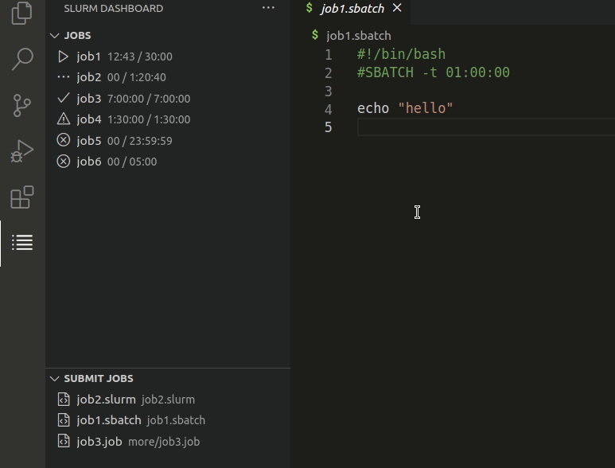

# Slurm Dashboard

A dashboard for interacting with the Slurm workload manager. It allows you to
see running jobs, cancel jobs, submit new jobs, and more.

## Features

There are two main views in this extension: Job Queue and Job Scripts. The first
view is a list of all current user jobs in the queue. Actions are provided for
canceling, resubmitting, and inspecting the jobs. The second view shows all
detected job scripts and provides actions for inspecting and/or running them.
These views are show in the highlight below.

## Requirements

This extension requires Slurm to be on the system where the workspace is
located. Currently it only works with Slurm, but PBS, BSUB, and Flux support is
planned.

## Extension Settings

This extension contributes the following settings:

* `slurm-dashboard.job-dashboard.showJobInfo`: Show all job metadata in the job list. Default: `false`
* `slurm-dashboard.job-dashboard.promptBeforeCancel`: Prompt user before canceling a job. Default: `true`
* `slurm-dashboard.job-dashboard.promptBeforeCancelAll`: Prompt user before cancelling all jobs. Default: `true`
* `slurm-dashboard.job-dashboard.refreshInterval`: How many seconds between refreshes of the job queue view. Set to `null` to turn off auto-refresh. Default: `300`
* `slurm-dashboard.submit-dashboard.jobScriptExtensions`: File extensions used to identify job scripts. Default: `[".sbatch", ".slurm", ".job"]`
* `slurm-dashboard.submit-dashboard.promptBeforeSubmitAll`: Prompt user before submitting all job scripts. Default: `true`
* `slurm-dashboard.setJobWorkingDirectoryToScriptDirectory`: Launch job scripts with the working directory as the location of the job script. Default: `true`
* `slurm-dashboard.backend`: Scheduler backend. Choices: `slurm`, `debug`. Default: `slurm`

## Known Issues

The following issues are known:

* Some Slurm configurations will silently fail when calling `sbatch` from a VSCode extension. This means the _submit job_ actions will not work, but no errors will be shown since Slurm silently fails. It is unknown what causes this.

## Release Notes

### 0.0.1

- Slurm support
- Job queue view
- Job script view

