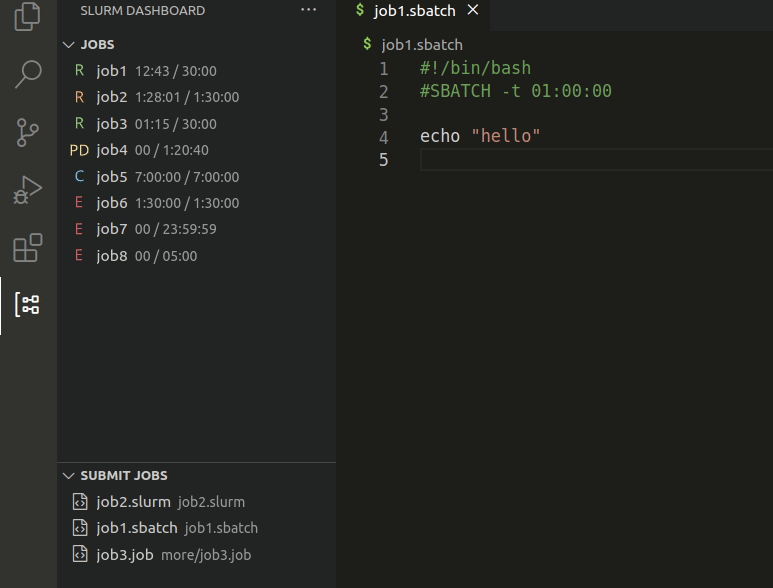

<h1 align="center">Slurm Dashboard</h1>

<b>A dashboard for interacting with the Slurm workload manager in VSCode. It allows
you to see running jobs, cancel jobs, submit new jobs, and more.</b>

&nbsp;&nbsp;&nbsp;&nbsp;

## Features

There are two main views in this extension: Job Queue and Job Scripts. The first
view is a list of all current user jobs in the queue. Actions are provided for
canceling, resubmitting, and inspecting the jobs. The second view shows all
detected job scripts and provides actions for inspecting and/or running them.
These views are shown in the highlight below.

## Requirements

This extension requires Slurm to be on the system where the workspace is
located. Currently it only works with Slurm, but PBS, BSUB, and Flux support is
planned.

## Extension Settings

This extension contributes the following settings:

* `slurm-dashboard.job-dashboard.showJobInfo`: Show all job metadata in the job
  list. Default: `false`
* `slurm-dashboard.job-dashboard.promptBeforeCancel`: Prompt user before
  canceling a job. Default: `true`
* `slurm-dashboard.job-dashboard.promptBeforeCancelAll`: Prompt user before
  cancelling all jobs. Default: `true`
* `slurm-dashboard.job-dashboard.refreshInterval`: How many seconds between
  refreshes of the job queue view. Set to `null` to turn off auto-refresh.
  Default: `300`
* `slurm-dashboard.job-dashboard.extrapolationInterval`: Extrapolate the job run
  times in the UI without querying the workload manager. Allows you to set a
  high job-dashboard.refreshInterval, but still see more realistic job run
  times. This has the danger of coming out of sync with the real times or not
  portraying job completion/failure, so it is turned off by default. Provide a
  number to specify the interval in seconds or null to disable extrapolation.
  Default: `null`
* `slurm-dashboard.job-dashboard.useNativeIcons`: Instead of the job status
  icons shipped with the extension, use VSCode native codicons. Default: `false`
* `slurm-dashboard.submit-dashboard.jobScriptExtensions`: File extensions used
  to identify job scripts. Default: `[".sbatch", ".slurm", ".job"]`
* `slurm-dashboard.submit-dashboard.promptBeforeSubmitAll`: Prompt user before
  submitting all job scripts. Default: `true`
* `slurm-dashboard.setJobWorkingDirectoryToScriptDirectory`: Launch job scripts
  with the working directory as the location of the job script. Default: `true`
* `slurm-dashboard.backend`: Scheduler backend. Choices: `slurm`, `debug`.
  Default: `slurm`

Most notable is the `job-dashboard.refreshInterval` setting. The job queue view
refreshes its data at regular intervals. To avoid overloading the login nodes or
the workload manager the refresh interval is set to a high value. By default it
is 300 seconds. This can be changed to the users preference or auto-refresh can
be turned off entirely by setting it to `null`.

If you still want to see live job times, you can set
`job-dashboard.extrapolationInterval`, which will extrapolate the current job
time based on the last available value from the workload manager. This will make
the UI more informative, but has the danger of coming out of sync with the real
job times and/or not capturing job completion and failure. However, these will
be updated the next time the jobs are refreshed from the queue. Due to these
reasons extrapolation is turned off by default. An example of what these look
like are shown below.

## Known Issues

The following issues are known:

* Some Slurm configurations will silently fail when calling `sbatch` from a
  VSCode extension. This means the _submit job_ actions will not work, but no
  errors will be shown since Slurm silently fails. It is unknown what causes
  this.

## Release Notes

### 0.0.3

- update icons for job queue

### 0.0.2

- update logo and readme

### 0.0.1

- Slurm support
- Job queue view
- Job script view

